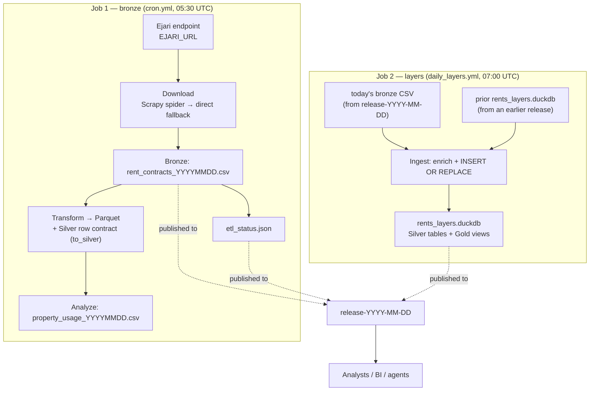

# Architecture

How the Dubai rental-market pipeline is shaped, and — more usefully — *why*.

The full decision record is in the [ADRs](adr/README.md). This document is the narrative
that ties them together.

## What it is

The system ingests **Ejari rent transactions** — registered tenancy contracts published by
the Dubai Land Department — and turns them into a cumulative rental-market store you can ask
questions of: "what is the median annual rent in Dubai Marina, and on how many contracts?",
"which metro stations see the most registrations?", "how has monthly registration volume
moved over all history?"

Sales, title deeds and short-term-stay data are **out of scope** (see [What it is not](#what-it-is-not)).

## The shape: a strict medallion

The layers are not decorative; each one has a contract.

| Layer | What it is | Where it lives | Keyed / filtered by |
|-------|------------|----------------|---------------------|
| **Bronze** | Raw files, exactly as the endpoint returned them | `rent_contracts_YYYYMMDD.csv` | — (source of truth) |
| **Silver** | Normalized DuckDB **tables** — dims + a contract-grain fact | `rents_layers.duckdb` | `FctContract.contract_id` (PK) |
| **Gold** | DuckDB **views** — published analytics | `rents_layers.duckdb` | median + `n`, with market exclusions |

**Bronze** is one file per day, untransformed and never edited. Everything else can be rebuilt
from it.

**Silver** is one row per **registration** in `FctContract` (the grain — ADR-02), with the
repeated descriptive text pushed into natural-key dimensions (`DimArea`, `DimPropertyType`,
`DimMetro`). Natural keys — `area_name_en`, type/sub-type/usage, metro name — not the upstream
`*_ID` columns, because those are single-valued in the payload (every row `0`) and would
produce one-row dimensions.

**Gold** is a set of views over the Silver tables **in the same file**. A plain
`duckdb.connect("rents_layers.duckdb")` resolves every view — no `ATTACH`, no catalog alias.
That single-file property is the point of ADR-10: the consumer downloads one artifact and
queries it.

## End to end

Two scheduled jobs run per day, in order.



Both jobs write to the **same** release tag, `release-YYYY-MM-DD`, derived from the **data
date** (yesterday, UTC) — not the run date. One release per data date carries the raw CSV,
the status marker, and a full snapshot of the cumulative DuckDB.

### Job 1 — the daily bronze extract

`run_etl_pipeline.py`. Stages: **Download → Transform → Analyze → Publish**.

- **Incremental window.** It asks the gateway for a 2-day window (yesterday → today) because a
  single-day range returns zero rows. The *data date* is yesterday.
- **Download** prefers the Scrapy spider (`rents_scraper/`) and falls back to the direct
  paginated downloader (`lib/extract/ejari_rents_downloader.py`). A `touch()`ed placeholder is
  a legitimate outcome: it means an empty window.
- **Transform** (`lib/transform/rents_transformer.py`) reads the raw CSV with the pinned
  44-column schema, parses dates, and adds canonical snake_case aliases. Then the **Silver row
  contract** (`lib/classes/silver_contract.to_silver`) validates and derives per-row facts.
- **Analyze** writes a property-usage report (best-effort).
- **Publish** pushes the raw CSV **and** `etl_status.json` to `release-YYYY-MM-DD`.

Everything about this job is **fail-open**: an empty window is a success, never an error — but
it is *never silent*. It writes `output/etl_status.json` (`outcome: no_data`) and logs a
greppable `NO_NEW_DATA` line, and the status file is published too. So from the release list
alone: **a missing release = the job did not run; a status-only release = it ran and found
nothing.**

### Job 2 — the daily layers ingest

`lib/analysis/build_layers_duckdb.py` (CLI: `python -m lib.analysis.build_layers_duckdb`).

1. Pulls the most recent earlier release that carries a `rents_layers.duckdb` (within 30 days)
   — the store is cumulative, so it is refreshed forward, not rebuilt.
2. Pulls today's bronze CSV from `release-YYYY-MM-DD`.
3. Enriches the increment (PSF, area tier, temporal features, duration, luxury flag, usage
   category, bulk flag) and `INSERT OR REPLACE`s it into `FctContract`.
4. Rebuilds the dimensions and the Gold views, and rewrites `_meta`.

## The store

One file, `rents_layers.duckdb`, holding both layers:

```
rents_layers.duckdb
├── Silver (tables)   DimArea, DimPropertyType, DimMetro, FctContract, _meta
└── Gold (views)      gold_area_median, gold_standard_lease, gold_top_metros_daily,
                      AggAreaRentStats, AggMetroPremium, AggMonthlyRegistrations,
                      AggProjectRentStats
```

Full column lists and every view's SQL contract are in the
[DATA_DICTIONARY](DATA_DICTIONARY.md).

## The invariants

These are the properties the system is built to preserve. Most have a test that pins them.

- **Idempotent by primary key.** `FctContract` is keyed on `contract_id` (the payload
  `CONTRACT_NUMBER`, falling back to `RN`). Re-ingesting a day — a same-day re-run, or the next
  day's overlapping 2-day window — *replaces* the row instead of duplicating it. This is a DB
  constraint, not cross-file dedup code.
- **Fail-open daily, fail-closed on a stalled feed.** A quiet day passes. But if the newest
  registration trails the data date its filename claims by more than
  `MAX_REGISTRATION_LAG_DAYS` (1), ingest **raises** and writes nothing. A stalled feed is a
  defect; a quiet day is not.
- **Median with `n`, always.** Every headline rent is a median (mean is carried beside it),
  every aggregate carries its sample size, and area medians require `n >= 10`. Hotel / Labor
  Camps sub-types, Virtual Unit property types and `is_bulk_registration` stock are excluded
  from rent medians.
- **One owner per rule.** The PSF floor (`PSF_MIN_AREA_SQFT = 200`), the PSF division
  (`psf_expression`), the publishing band (`psf_band_filter`), the bulk threshold
  (`BULK_GROUP_MAX`), the sample floor (`min_area_sample_size`) and the raw schema
  (`RAW_RENTS_CSV_DTYPES`) each have exactly one definition. Tests assert the consumers read
  from it rather than restating it.
- **Grain.** Aggregates run over `FctContract` (one row per registration), so a multi-property
  contract block is not counted once per property.
- **The views resolve in-file.** No `ATTACH`, no alias. If a test opens the file plainly and
  selects from a view, it must work.
- **One release per data date.** The raw CSV, the status marker and the DuckDB share the tag
  `release-YYYY-MM-DD`. There is no second tag stream.
- **Secrets never reach logs.** `EJARI_URL` may carry a token in its query string; the download
  log redacts it.

## Where the code lives

```
run_etl_pipeline.py            Job 1 orchestrator (Download → Transform → Analyze → Publish)
rents_scraper/                 Scrapy spider for the Ejari endpoint (the fast path)
lib/
├── config.py                  All constants: schema, thresholds, area tiers, PSF owner
├── logging_helpers.py         READ.* logger setup
├── extract/                   Direct paginated downloader (fallback)
├── transform/                 CSV → parquet (RentsTransformer) + enrichment
├── classes/
│   ├── silver_contract.py     Per-row pydantic contract + keys + block rollup
│   ├── validators.py          Aggregate frame sanity (not per-row ranges)
│   ├── market_analytics.py    In-memory analytics over a Polars frame
│   └── property_usage.py      Property-usage report
├── analysis/
│   ├── build_layers_duckdb.py Job 2 entry point (cumulative ingest)
│   ├── silver_layer.py        Silver table DDL + idempotent insert SQL
│   ├── gold_layer.py          The seven Gold view definitions
│   ├── layers.py              connect_layers() — the reader helper
│   ├── metro_volume.py        Worked example querying a Gold view
│   └── gold_indexes.py        Pending-extraction market-health gates (not on the live path)
└── workspace/
    ├── github_client.py       GitHub release client (create / clobber-upload)
    └── publish_layers.py      Add the DuckDB to the day's release
```

> **Two "Silver"s, on purpose.** The *row-level* Silver is the pydantic contract in
> `lib/classes/silver_contract.py` (a validated parquet). The *table-level* Silver is the
> normalized DuckDB tables in `lib/analysis/silver_layer.py`. Same word, different artifacts —
> the row contract is about a single registration, the tables are about the store.

## What it is not

- **Not the sales market.** Ejari is tenancy registration. There are no sale prices here, so a
  **yield cannot be computed from this repo alone** — you need external capital values, service
  charges, vacancy and fees. See the `dubai-real-estate-investor` skill.
- **Not a listing feed.** Every row is a *registered contract*, not an asking price.
- **Not a data warehouse.** The published artifact is a single DuckDB file that grows daily.
  Fine to a few hundred MB; object storage beyond that (a noted ceiling in ADR-10).

## The decisions, if you read nothing else

- **ADR-10** — cumulative daily store, one file, primary-key upsert. Supersedes the weekly
  two-file build (ADR-07, ADR-08). This is the current architecture.
- **ADR-06** — per-row pydantic contract, so violations are named.
- **ADR-09** — pin the whole raw schema; mark every run; one publish path.
- **ADR-11** — locked deps and a CI gate.
